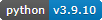

    
**TravEncounters**
==================

.. figure:: images/travencounters.png

**TravEncounters** is a Python 3.x program that generates encounters for Mongoose Traveller 1st Edition in a web browser.

Requirements
------------

* **Windows 10**

   It might not work in OSX or Linux.
   
* **Python 3.9.10**
   
   **TravEncounters** was written using the C implementation of Python
   version 3.9.10. Also known as CPython.

* **bottle 0.12.19**

   bottle is the web framework used.
   
* **colorama 0.4.4**

   Because the dice roller may have some colored text messages for debugging.

Warning
-------

**TravEncounters** will not work with **Python 2.7-**.

Starting the Program
--------------------

Double-click ``TravEncounters.py`` to start the WSGI micro web-framework. Then enter http://localhost:8080/encounters in your web browser.

Not Using Python?
-----------------

You can always run the .EXE version for Windows 10 if you don't have the Python language installed.

.. |ss| raw:: html

    <strike>

.. |se| raw:: html

    </strike>

Things To-Do
------------

| Finish space encounters.
| Animal encounters.
| NPC encounters.
|ss|

| Move PDF character sheets closer to program folder.
| Add Encumbrance rules from Rocket Cadets in the 11th Dimension!
| Start on a To-Do.

|se|

**Known History**

* v0.0.1

  * Testing space encounters.

Contact
-------

Questions? Please contact shawndriscoll@hotmail.com

The Traveller game in all forms is owned by Far Future Enterprises.
Copyright 1977 - 2022 Far Future Enterprises.
Traveller is a registered trademark of Far Future Enterprises.
