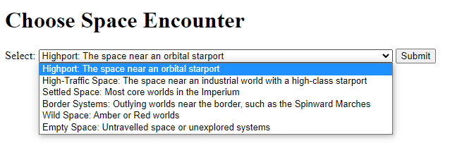
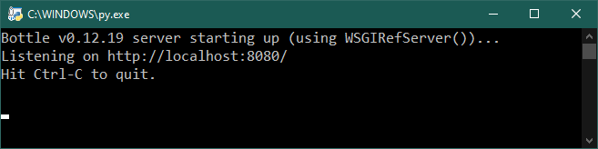

    
**TravEncounters (alpha release)**
==================================

**TravEncounters** is a Python 3.9 program that generates encounters for Mongoose Traveller 1st Edition in a web browser.

Requirements
------------

* **Windows 10**

  Has not been tested with Windows 11.

* **Python 3.9**

  **TravEncounters** was written using the C implementation of Python
  version 3.9. Also known as CPython.

* **bottle 0.12.19**

  bottle is the web framework used.

Warning
-------

**TravEncounters** will not work with **Python 2.7-**.

Starting the Program
--------------------

Double-click ``TravEncounters.py`` to start the WSGI micro web-framework. Then enter http://localhost:8080/encounters in your web browser.

Not Using Python?
-----------------

You can always run the .EXE version for Windows 10 (found in the dist folder) if you don't have the Python language installed.

.. |ss| raw:: html

    <strike>

.. |se| raw:: html

    </strike>

Things To-Do
------------

| Finish space encounters.
| Finish NPC encounters.
| Need Animal encounters.
|ss|

| Start on NPC encounters.
| Removed colorama requirement.
| Begin on space encounters.
| Debate on whether to do this project for a web browser or as a PyQt5 app.
| Start on a To-Do.

|se|

**Known History**

* v0.2.1a

  Switched over to using **pydice** for die rolling.

* v0.2.0a

  Began adding logging for the app.
  Added a bit to space encounters.
  Added the beginnings for an NPC encounter.

* v0.1.0a

  Removed requirement for colorama.

* v0.0.1a

  Testing space encounters.

Contact
-------

Questions? Please contact shawndriscoll@hotmail.com

The Traveller game in all forms is owned by Far Future Enterprises.
Copyright 1977 - 2022 Far Future Enterprises.
Traveller is a registered trademark of Far Future Enterprises.
